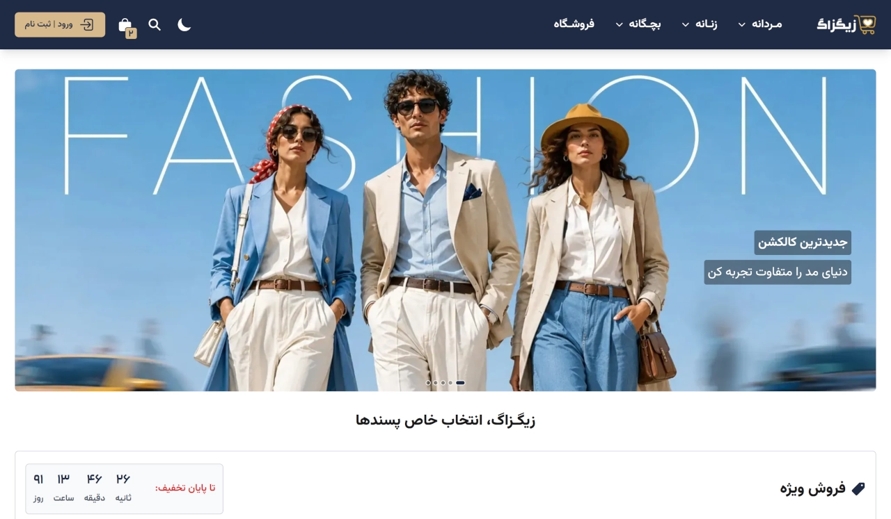

# ZigZag (React js)

> A modern clothing e-commerce website built with React and Vite.

### Technologies:

- React
- React Router
- Tailwind Css
- Swiper
- React Toastify
- Vite ImageTools
- Json Server

### Features:

- Context API
- Shopping Cart
- Product Filtering
- Responsive Design
- Form Validation
- Dynamic Login & Signup
- Dynamic Product Search
- Custom Hooks
- Dark Mode
- Toast Notifications
- Modal Management
- Mock Backend with Json Server

## Lighthouse Report

- Performance: 92
- Accessibility: 98
- Best Practices: 100
- SEO: 92

  

### Backend

This project uses JSON Server as a mock REST API for development and demonstration purposes.
